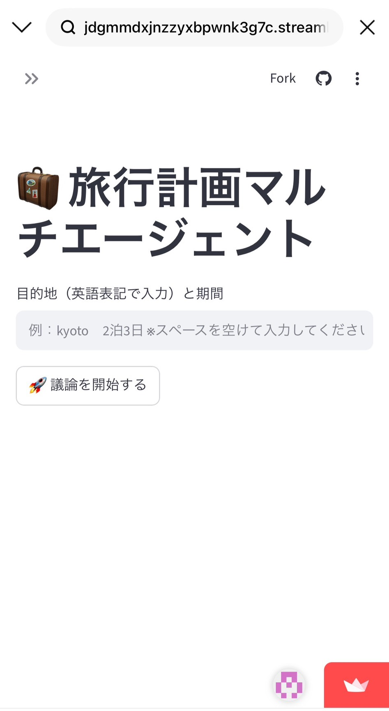
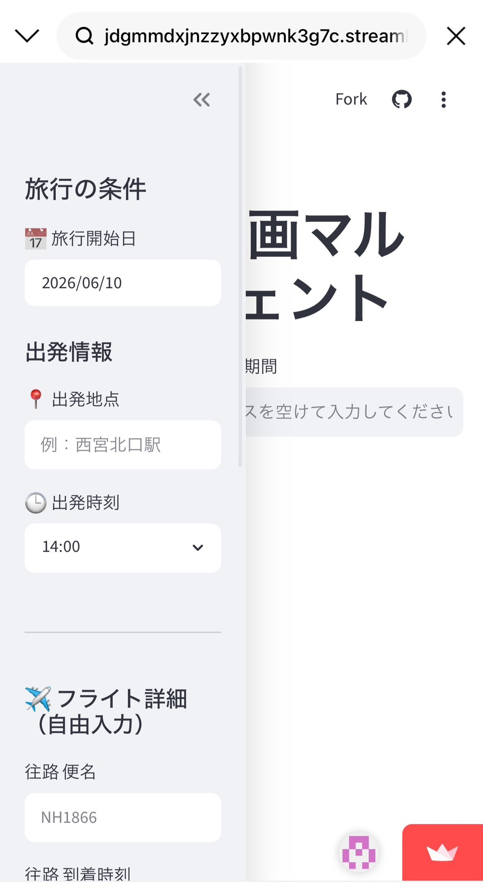
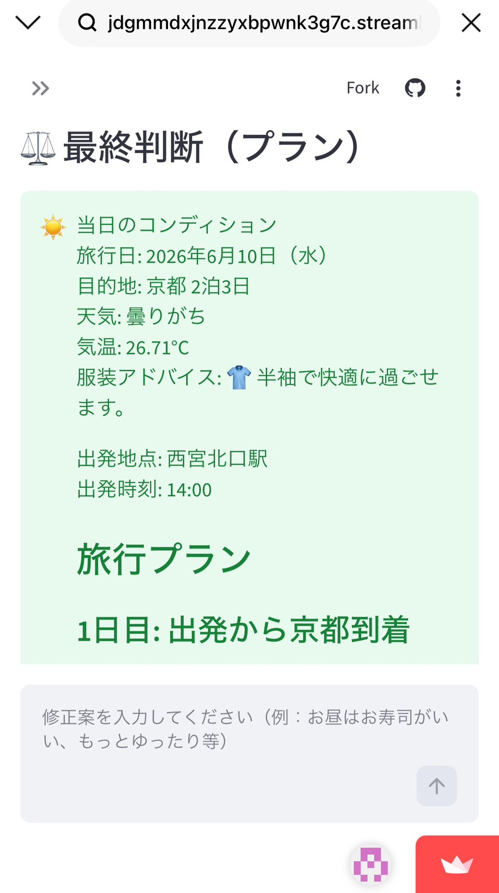
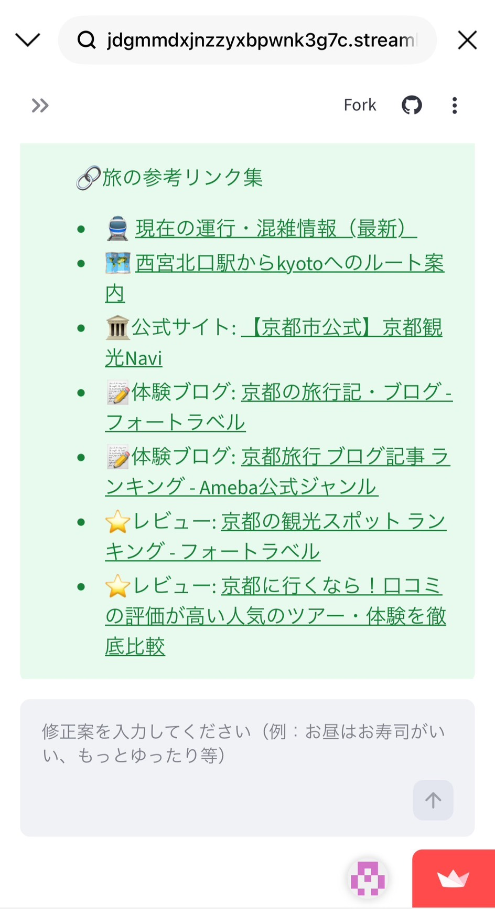

# Travel-Planning-Multi-Agent (旅行計画マルチエージェント)

## 概要
AIエージェントが旅行プランを自動作成するWebアプリケーションです。3人の異なる役割を持つAIが議論し、営業時間や天候といった「現実的な制約」まで考慮した、実現可能性の高い旅行計画を提案します。

### アプリケーションの操作イメージ

↪まずユーザーは目的地を英語で入力し、希望する旅行期間（例: kyoto 2泊3日）をスペース区切りで入力します。

↪直感的な入力:旅行条件や出発地、フライト情報などを入力し議論開始のボタンを押します。

↪AIによる議論:AIエージェントがユーザーの希望と現実的な制約（営業時間等）を照らし合わせ、議論を通じてプランを最適化します。

↪実用的な周辺情報:観光スポットの公式リンクや混雑状況、天候、服装アドバイスまで含めた包括的な旅行プランを提案します。

＊＊対話的なプラン修正＊＊: 提案されたプランに対し、追加の要望を投げかけるだけで、AIが即座にプランを再最適化します。

## 開発の背景
AIが生成する旅行プランの精度を検証した際、「定休日・営業時間外のスポット提示」や「誤った交通案内」という不整合が発生しました。この実地検証で見えた「現場のリアルな制約」を解消するため、外部APIとの連携によるロジック改善を徹底しました。

## 開発のハイライト（主要な改善プロセス）
合計21回のコミットを通じて、ユーザー体験の向上とシステムの堅牢化を追求しました。

- **【精度向上】実地検証とAPI連携**:
  Google Maps APIを導入し、店舗のリアルタイムな営業時間や定休日を判定ロジックに組み込みました。実際に現地検証を行い、計画の不整合を一つずつ潰すことで実用性を確保しました。
- **【UX改善】ユーザー負荷の軽減**:
  フライト出発時刻から「到着時刻」ベースの計画設計に変更。ユーザーが直感的に入力でき、かつAIが計画を立てやすい「構造化された入力項目」を実現しました。
- **【信頼性向上】検索ロジックの最適化**:
  Serper APIによる外部検索を導入し、最新の公式情報やレビュー、交通案内を併せて掲示。ハルシネーションを抑制し、旅行者が安心して旅行に臨める情報を揃えました。

## 使用技術 (Tech Stack)
- **言語**: Python
- **主要ライブラリ・フレームワーク**: FastAPI, Streamlit, LangChain
- **外部API**: OpenAI API (GPT-4o), Google Maps API, OpenWeatherMap API, Serper API
- **インフラ・環境**: GitHub (バージョン管理), Streamlit Cloud (デプロイ), Dev Containers

## 学び

AIが生成する情報の不整合（営業時間外のスポット提示など）を実地検証で発見し、外部API連携による検証ロジックを実装することで解決しました。「動くコード」より「実用に耐えるシステム」を意識した設計の重要性を実感しました。
